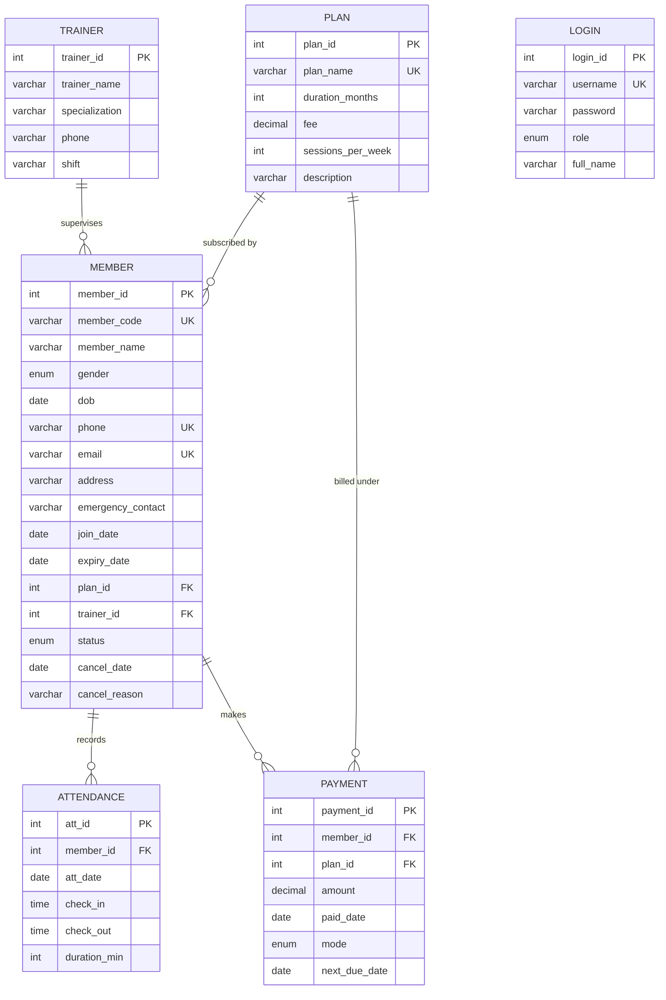
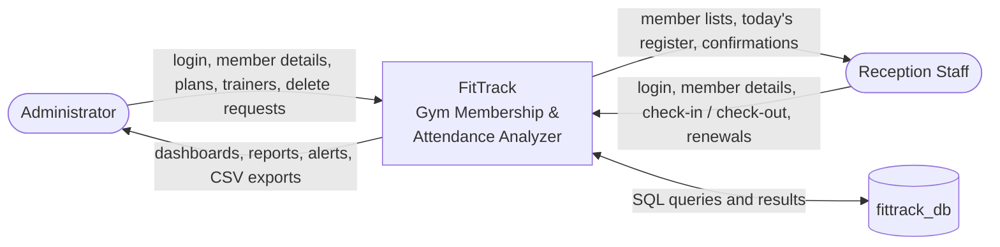
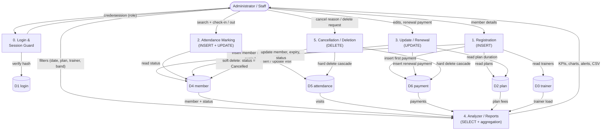

# FitTrack: Gym Membership & Attendance Analyzer
## CS2307 — Internet Programming Laboratory — Mini Project Report Content

**Student:** Pavithran · **Class:** III Year B.Tech — Artificial Intelligence and Data Science
**Register Number:** 21UAD___
**College:** Kamaraj College of Engineering and Technology (An Autonomous Institution — Affiliated to Anna University, Chennai), K. Vellakulam, Virudhunagar - 625 701
**Department:** Department of Artificial Intelligence and Data Science
**Submission:** October, 2026

> Each section below is written to be pasted directly into the report under the
> matching chapter heading.

---
---

# ABSTRACT

Small and mid-sized gymnasiums in India still track memberships and daily attendance in paper registers. A register can record that a member walked in, but it cannot answer the questions an owner actually needs answered: which member has quietly stopped coming, whose plan expires this week, which hours of the day are overcrowded, which plan earns the most revenue, and whether a member is genuinely getting value from the plan they paid for. Because the data is never aggregated, retention problems are noticed only after the member has already left. FitTrack — Gym Membership and Attendance Analyzer is a web application built with HTML5, CSS3, JavaScript, Bootstrap 5, Chart.js, PHP 8 and MySQL that replaces the paper register with a normalized relational database and then analyzes the data it collects. It is developed without any framework, using PDO prepared statements for every database access and PHP sessions for role-based authentication.

The first module, **Registration**, performs the INSERT operation. It captures a member's personal details, plan selection, trainer assignment and emergency contact, validating every field on the server: required fields, a well-formed email address, a phone number of exactly ten digits, and an age between 12 and 80 derived from the date of birth, with duplicate phone numbers and e-mail addresses rejected. On successful validation, the system auto-generates a sequential member code in the form FT-2026-001, computes the plan expiry date as join date plus plan duration, inserts the first payment record, and sets the membership status to Active — all within a single database transaction. Separate administrative screens register new plans and new trainers.

The second module, **Attendance Marking**, performs INSERT and UPDATE. Staff search for a member by code, name or phone and record a check-in; a second action on the same member the same day records the check-out and computes the workout duration in minutes. A composite UNIQUE key on member and date makes a duplicate check-in impossible at the database level, and members whose status is Expired or Cancelled are refused entry with a direct link to renewal. A bulk-marking screen records a batch of members for a chosen date inside one transaction. The third module, **Update and Renewal**, performs UPDATE: personal details are edited from a pre-filled form, trainers are reassigned, and renewals extend the expiry date as the greater of the current expiry and today plus the new plan duration, restoring the status to Active and inserting a fresh payment row.

The fourth module, the **Analyzer**, is the core contribution and performs SELECT with aggregation. Using GROUP BY, COUNT, SUM, AVG, DATEDIFF, HAVING and JOIN — rather than loops in PHP — it produces attendance percentage per member banded as Excellent, Good, Poor or Critical, current and longest visit streaks, a dropout-risk flag for active members absent ten or more days, peak-hour and weekday footfall analysis, a six-month attendance trend, plan-wise distribution and revenue, trainer load with the average attendance of each trainer's members, and renewal alerts. Results are presented as KPI cards and Chart.js charts, filtered by date range, plan, trainer and attendance band, and exported to CSV or printed. The fifth module, **Cancellation and Deletion**, performs DELETE: a reversible soft delete records a cancellation reason and date, while an admin-only permanent delete removes a member and cascades their attendance and payment rows inside a transaction. The proposed system converts a passive register into an early-warning tool that lets a gym owner act on falling attendance before a member is lost, plan renewals before they lapse, and staffing before peak hours become unmanageable.

---
---

# CHAPTER I — INTRODUCTION

## 1.1 Overview

FitTrack is a database-driven web application that manages the day-to-day operation of a gymnasium and analyzes the resulting data. The system maintains six related tables — plans, trainers, members, attendance, payments and login accounts — in a normalized MySQL database, and exposes them through a set of PHP pages organized into five functional modules: registration, attendance marking, update and renewal, analysis and reporting, and cancellation or deletion. A supporting login module provides role-based access, distinguishing an administrator with full privileges from a staff user who may register members, mark attendance and read reports but may not permanently delete records.

The application is built strictly with the technologies permitted in the Internet Programming Laboratory. The presentation layer uses HTML5, CSS3, vanilla JavaScript and the Bootstrap 5 grid, with Chart.js rendering the analytical charts from data passed as JSON from PHP. The application layer is procedural PHP 8 with no framework and no build tooling, and the data layer is MySQL accessed exclusively through PDO prepared statements. The entire project runs by copying one folder into the XAMPP `htdocs` directory and importing a single SQL file, which creates the schema, a summary view and realistic seed data covering thirty members and roughly nineteen hundred attendance records.

What distinguishes FitTrack from a conventional CRUD application is the analyzer. Every stored check-in is treated not merely as a record but as an input to a metric: an attendance percentage computed over the member's own plan window, a streak of consecutive attended days, a dropout-risk classification based on days since the last visit, an hourly load profile of the gym, and plan-wise and trainer-wise performance summaries. These computations are expressed as SQL aggregate queries so that the database, not the application code, does the heavy work.

## 1.2 Motivation

The motivation for this project arose from observing how a neighbourhood gymnasium actually operates. Attendance is recorded by asking members to sign a ruled notebook at the entrance. The notebook faithfully accumulates hundreds of signatures a month, yet nobody ever reads it backwards. When a member stops attending, the absence is invisible: there is no page that lists who has not signed in for three weeks. When a membership expires, it is usually discovered only when the member happens to visit. When the gym is uncomfortably crowded at seven in the morning, the owner senses it but cannot quantify it or justify hiring a second trainer for that shift.

The underlying problem is that the data is captured in a form that cannot be queried. A paper register supports appending but not aggregation, filtering or comparison. Meanwhile the same gym already possesses a computer at the reception desk and every member already carries a phone. The gap is therefore not one of data collection but of data organization. Storing the same information in a relational database immediately makes questions answerable that were previously unanswerable, and answering them is a matter of writing the right SELECT statement rather than of collecting any new information.

A second motivation was pedagogical. The Internet Programming Laboratory requires a project demonstrating five distinct database operations. Rather than treating those five operations as five disconnected exercises, a gym management scenario binds them into a coherent story: a member is registered (INSERT), attends (INSERT and UPDATE), renews (UPDATE), is analyzed (SELECT with aggregation) and eventually leaves (DELETE). The analyzer in particular gave a reason to write non-trivial SQL involving GROUP BY, HAVING, DATEDIFF and correlated subqueries, which is where most of the learning in this project took place.

## 1.3 Importance of the Work

Member retention is the single largest financial lever a gymnasium has. Acquiring a new member costs far more in advertising and discounting than retaining an existing one, and yet attrition is almost always noticed too late — after the member has already decided to leave. FitTrack's dropout-risk flag addresses exactly this window. By listing every active member who has not visited for ten or more days, and escalating to "Likely Dropout" at twenty-one days, the system converts an invisible drift into a concrete call list that reception staff can act on the same day. The same logic applied to expiry dates produces a renewal alert seven days in advance, which is the difference between a renewal conversation and a lapsed membership.

The work is also important as a demonstration of how much analytical value is latent in ordinary transactional data. No additional sensors, hardware or member effort are required: the attendance rows the gym already wanted to record are the same rows that produce the peak-hour histogram, the weekday footfall profile, the six-month trend and each member's attendance percentage. This illustrates a principle central to the Artificial Intelligence and Data Science curriculum — that well-structured data collection is a prerequisite for analysis, and that a correctly normalized schema makes analysis a query rather than a project.

Finally, the project demonstrates secure and maintainable web development practice at a scale a student can fully explain. Every query is a prepared statement, which structurally eliminates SQL injection; every output is escaped, which prevents cross-site scripting; every state-changing form carries a CSRF token; passwords are stored as bcrypt hashes rather than plain text; and multi-table writes are wrapped in transactions so a partial failure cannot leave the database inconsistent. These are habits that transfer directly to professional practice.

## 1.4 Objectives

- To design a normalized relational database in Third Normal Form that stores gym plans, trainers, members, daily attendance, payments and login accounts without redundancy, enforcing integrity through primary keys, foreign keys, UNIQUE constraints and referential actions.
- To implement the five prescribed database operations as five clearly separated functional modules — registration (INSERT), attendance marking (INSERT and UPDATE), update and renewal (UPDATE), analysis and reporting (SELECT with aggregation) and cancellation or deletion (DELETE) — each with its own pages and validation.
- To develop an analyzer that derives actionable metrics from raw attendance data using SQL aggregation, including attendance percentage with banding, visit streaks, dropout-risk classification, peak-hour and weekday load, monthly trends, plan-wise revenue, trainer load and renewal alerts.
- To present the analysis through a responsive, accessible dashboard using Bootstrap 5 and Chart.js, with filtering by date range, plan, trainer and attendance band, and with CSV export and print-friendly output for record keeping.
- To enforce application security through PDO prepared statements for every query, output escaping, CSRF tokens on all POST forms, bcrypt password hashing, session-based role authentication and transactional multi-table writes.
- To deliver the complete system as a self-contained deployment that runs on XAMPP by copying one folder into `htdocs` and importing a single SQL file, with seed data sufficient to demonstrate every report.

---
---

# CHAPTER II — SYSTEM REQUIREMENT SPECIFICATION

Requirement analysis for FitTrack began by identifying the actors who interact with the system and the operations each must perform. Two actors were identified: the gymnasium administrator, who requires unrestricted access including the permanent removal of records, and the reception staff member, who must be able to register members, mark daily attendance and read reports but must not be able to destroy data irreversibly. From these actors the functional requirements were derived — member registration with validation, daily check-in and check-out, membership renewal with payment capture, analytical reporting, and cancellation with an auditable reason — and mapped onto the five database operations the laboratory syllabus prescribes.

The non-functional requirements followed from the deployment context. Because the application must run on a college laboratory machine and on a gymnasium's reception computer, it was constrained to the XAMPP stack with no external dependencies beyond two CDN-hosted libraries, no build step and no package manager. Because reception staff may use a phone or tablet, the interface was required to be responsive. Because the system stores personal data and financial records, prepared statements, password hashing, CSRF protection and role separation were treated as mandatory rather than optional. Because the project must be demonstrated in a viva, the code was required to be readable and commented rather than clever, and the database was required to arrive pre-populated with data realistic enough that every chart and every report displays meaningful output. The hardware and software requirements below were fixed on this basis.

## 2.1 Hardware Requirements

| Component | Specification |
|---|---|
| Operating System | Windows 10 / Windows 11 (64-bit), or any OS supporting XAMPP |
| Processor | Intel Core i3 (2.0 GHz) or higher |
| RAM | 4 GB minimum (8 GB recommended) |
| Hard Disk | 500 MB free space (XAMPP installation plus project and database) |
| Display | 1366 × 768 resolution or higher |
| Input Devices | Standard keyboard and mouse |

## 2.2 Software Requirements

| Component | Specification |
|---|---|
| Web Server Package | XAMPP 8.2.x (Apache 2.4 + MySQL/MariaDB + PHP bundle) |
| Server-side Language | PHP 8.2 (PDO and pdo_mysql extensions enabled) |
| Database | MySQL 8.0 / MariaDB 10.4 |
| Database Administration | phpMyAdmin 5.2 (bundled with XAMPP) |
| Web Browser | Google Chrome 120+, Microsoft Edge 120+, or Mozilla Firefox 120+ |
| Code Editor | Visual Studio Code 1.85 (or Notepad++ 8.x) |
| CSS Framework | Bootstrap 5.3.3 (via CDN) |
| Charting Library | Chart.js 4.4.4 (via CDN) |
| Icon Library | Bootstrap Icons 1.11.3 (via CDN) |
| Web Technologies | HTML5, CSS3, JavaScript (ES6) |

---
---

# CHAPTER III — SYSTEM DESIGN

## 3.1 Database Design

The database `fittrack_db` consists of six base tables and one view. The design separates the things the gymnasium owns and describes — plans, trainers and login accounts — from the things that happen over time — memberships, attendance events and payments. This separation is what allows a plan's fee to be corrected in one place without rewriting history, a trainer to be removed without deleting their members, and a member's entire visit history to be summarized without duplicating any of their personal details.

Three relationships bind the schema together. A plan is subscribed to by many members, and a trainer supervises many members, giving two one-to-many relationships into the `member` table. The `member` table in turn is the parent of two one-to-many relationships: one member generates many attendance rows and many payment rows. The `login` table stands apart, holding only the credentials of the staff who operate the system rather than any gym data.

Referential actions were chosen to reflect real-world meaning rather than convenience. Attendance and payment rows have no independent existence once their member is removed, so both foreign keys declare `ON DELETE CASCADE`. A trainer, by contrast, may resign while their members remain enrolled, so `member.trainer_id` declares `ON DELETE SET NULL`, leaving those members merely unassigned. A plan referenced by any member or payment cannot be deleted at all; the application refuses the operation with an explanatory message rather than silently breaking the revenue history. Finally, a composite `UNIQUE (member_id, att_date)` on the attendance table makes a second check-in on the same day impossible at the storage level, so the rule cannot be bypassed even by a defective page.

### 3.1.1 ER Diagram

**Mermaid source** (paste into the Mermaid Live Editor at mermaid.live to render, or into any Mermaid-aware tool):

**Plain-text entity / attribute / relationship listing** (for redrawing in draw.io):

**ENTITIES AND ATTRIBUTES** (primary key underlined in the diagram; UK = unique; FK = foreign key)

1. **PLAN** — <u>plan_id</u> (PK), plan_name (UK), duration_months, fee, sessions_per_week, description
2. **TRAINER** — <u>trainer_id</u> (PK), trainer_name, specialization, phone, shift
3. **MEMBER** — <u>member_id</u> (PK), member_code (UK), member_name, gender, dob, phone (UK), email (UK), address, emergency_contact, join_date, expiry_date, plan_id (FK), trainer_id (FK), status, cancel_date, cancel_reason
4. **ATTENDANCE** — <u>att_id</u> (PK), member_id (FK), att_date, check_in, check_out, duration_min — composite UNIQUE (member_id, att_date)
5. **PAYMENT** — <u>payment_id</u> (PK), member_id (FK), plan_id (FK), amount, paid_date, mode, next_due_date
6. **LOGIN** — <u>login_id</u> (PK), username (UK), password, role, full_name

**RELATIONSHIPS**

| # | Parent | Relationship | Child | Cardinality | Referential action |
|---|---|---|---|---|---|
| R1 | PLAN | *is subscribed to by* | MEMBER | 1 : M | RESTRICT (delete refused while in use) |
| R2 | TRAINER | *supervises* | MEMBER | 1 : M (optional) | ON DELETE SET NULL |
| R3 | MEMBER | *records* | ATTENDANCE | 1 : M | ON DELETE CASCADE |
| R4 | MEMBER | *makes* | PAYMENT | 1 : M | ON DELETE CASCADE |
| R5 | PLAN | *is billed under* | PAYMENT | 1 : M | RESTRICT |
| — | LOGIN | (standalone — operator accounts) | — | — | — |

**Drawing notes for draw.io:** place MEMBER at the centre; PLAN and TRAINER above it feeding in; ATTENDANCE and PAYMENT below it; draw crow's-foot notation with the "many" end at MEMBER for R1 and R2, and at ATTENDANCE/PAYMENT for R3, R4 and R5; LOGIN sits to one side with no connector.

### 3.1.2 Normalization

The following walks a single unnormalized gym register through First, Second and Third Normal Form, arriving at the six tables actually implemented.

**Unnormalized Form (UNF)**

Imagine the paper register transcribed literally into one spreadsheet, one row per member, with the visit history and payments crammed into repeating columns:

| member_code | member_name | phone | plan_name | plan_fee | plan_duration | trainer_name | trainer_phone | trainer_spec | visit_dates | check_in_times | payments |
|---|---|---|---|---|---|---|---|---|---|---|---|
| FT-2026-005 | Elango Murugan | 9500001005 | Annual | 5999 | 12 | Arjun Selvam | 9876543210 | Strength | 2026-09-28, 2026-09-29, 2026-09-30 | 06:20, 06:45, 07:10 | 5999 on 2026-02-20 (Cash) |
| FT-2026-011 | Karthik Raj | 9500001011 | Annual | 5999 | 12 | Karthick Murugan | 9876543212 | CrossFit | 2026-09-29, 2026-09-30 | 07:05, 06:50 | 5999 on 2026-04-01 (UPI) |

This table is unusable. The `visit_dates`, `check_in_times` and `payments` columns hold **repeating groups** — many values in one cell — so no query can ask "how many members came on 29 September" without parsing text. Plan and trainer details are **repeated** on every member row, so correcting the Annual fee means editing every row that mentions it.

**First Normal Form (1NF) — eliminate repeating groups; every attribute atomic**

A relation is in 1NF when every cell holds a single value and each row is uniquely identifiable. The repeating groups are removed by giving each visit and each payment its own row:

`MEMBER_VISIT_UNF (member_code, member_name, phone, plan_name, plan_fee, plan_duration, trainer_name, trainer_phone, trainer_spec, att_date, check_in, check_out, amount, paid_date, mode)`

Primary key: (member_code, att_date) — one visit per member per day.

Every cell is now atomic and the relation is in 1NF. However, the member's name, phone, plan and trainer are now repeated on *every visit row*: a member who attends two hundred times stores their name two hundred times. This is the update anomaly 2NF addresses.

**Second Normal Form (2NF) — remove partial dependencies on part of a composite key**

A relation is in 2NF when it is in 1NF and every non-key attribute is functionally dependent on the **whole** primary key, not merely a part of it. Examining the 1NF relation against its composite key (member_code, att_date):

- `member_name`, `phone`, `plan_name`, `plan_fee`, `plan_duration`, `trainer_name`, `trainer_phone`, `trainer_spec` depend on **member_code alone** — they are the same regardless of which date's row we look at. These are **partial dependencies**.
- `check_in`, `check_out`, `duration_min` depend on the **full key** (member_code, att_date) — they differ from visit to visit. These are correct.
- `amount`, `paid_date`, `mode` depend on neither part cleanly; a payment is its own event, unrelated to any particular attendance date.

Splitting on these dependencies yields:

- `MEMBER_2NF (member_code PK, member_name, phone, email, dob, gender, address, emergency_contact, join_date, expiry_date, status, plan_name, plan_fee, plan_duration, trainer_name, trainer_phone, trainer_spec)`
- `ATTENDANCE_2NF (member_code, att_date) PK, check_in, check_out, duration_min`
- `PAYMENT_2NF (payment_id PK, member_code, amount, paid_date, mode, next_due_date)`

All partial dependencies are gone, so the schema is in 2NF.

**Third Normal Form (3NF) — remove transitive dependencies on non-key attributes**

A relation is in 3NF when it is in 2NF and no non-key attribute depends on another non-key attribute. `MEMBER_2NF` still violates this:

- `member_code → plan_name → plan_fee, plan_duration, sessions_per_week`
  The fee depends on the *plan*, and the plan depends on the member — a **transitive dependency**. If the Annual fee changes from ₹5,999 to ₹6,499, every Annual member's row must be updated, and if the last Annual member is deleted the plan's very existence is lost (a deletion anomaly).
- `member_code → trainer_name → trainer_phone, trainer_spec`
  The same transitive pattern: a trainer's phone number depends on the trainer, not on the member.

Removing both transitive dependencies into their own relations gives the **final six tables implemented in FitTrack**:

| # | Relation | Attributes | Key |
|---|---|---|---|
| 1 | **plan** | plan_id, plan_name, duration_months, fee, sessions_per_week, description | PK plan_id; UK plan_name |
| 2 | **trainer** | trainer_id, trainer_name, specialization, phone, shift | PK trainer_id |
| 3 | **member** | member_id, member_code, member_name, gender, dob, phone, email, address, emergency_contact, join_date, expiry_date, plan_id, trainer_id, status, cancel_date, cancel_reason | PK member_id; UK member_code, phone, email; FK plan_id, trainer_id |
| 4 | **attendance** | att_id, member_id, att_date, check_in, check_out, duration_min | PK att_id; UK (member_id, att_date); FK member_id |
| 5 | **payment** | payment_id, member_id, plan_id, amount, paid_date, mode, next_due_date | PK payment_id; FK member_id, plan_id |
| 6 | **login** | login_id, username, password, role, full_name | PK login_id; UK username |

Every non-key attribute in every relation now depends on the key, the whole key, and nothing but the key. The schema is in Third Normal Form.

One deliberate design note: `payment` stores both `plan_id` and `amount` even though the plan already carries a fee. This is not redundancy but **historical fact** — the amount actually collected on that date, which must not change when the plan's fee is later revised. Similarly `attendance.duration_min` is stored rather than recomputed, because it is derived from the check-in and check-out that were recorded at that moment.

### 3.1.3 Data Dictionary

**Table: plan** — stores the membership plans offered by the gymnasium.

| S.No | Column Name | Data Type | Length | Constraint | Description |
|---|---|---|---|---|---|
| 1 | plan_id | INT | 11 | PRIMARY KEY, AUTO_INCREMENT | Surrogate key identifying the plan |
| 2 | plan_name | VARCHAR | 30 | NOT NULL, UNIQUE | Plan name (Monthly, Quarterly, Half-Yearly, Annual, Student) |
| 3 | duration_months | INT | 11 | NOT NULL | Validity of the plan in months; drives expiry computation |
| 4 | fee | DECIMAL | 10,2 | NOT NULL | Current price of the plan in rupees |
| 5 | sessions_per_week | INT | 11 | DEFAULT 6 | Sessions per week included in the plan |
| 6 | description | VARCHAR | 100 | NULL | Short description shown on the registration form |

**Table: trainer** — stores the gymnasium's trainers.

| S.No | Column Name | Data Type | Length | Constraint | Description |
|---|---|---|---|---|---|
| 1 | trainer_id | INT | 11 | PRIMARY KEY, AUTO_INCREMENT | Surrogate key identifying the trainer |
| 2 | trainer_name | VARCHAR | 40 | NOT NULL | Full name of the trainer |
| 3 | specialization | VARCHAR | 30 | NULL | Area of expertise (Strength, Cardio, CrossFit, Yoga, Rehab) |
| 4 | phone | VARCHAR | 10 | NULL | Ten-digit contact number |
| 5 | shift | VARCHAR | 20 | NULL | Working shift (Morning, Evening, Both) |

**Table: member** — the core record of an enrolled member.

| S.No | Column Name | Data Type | Length | Constraint | Description |
|---|---|---|---|---|---|
| 1 | member_id | INT | 11 | PRIMARY KEY, AUTO_INCREMENT | Surrogate key identifying the member |
| 2 | member_code | VARCHAR | 15 | NOT NULL, UNIQUE | Human-readable code auto-generated as FT-YYYY-NNN |
| 3 | member_name | VARCHAR | 50 | NOT NULL | Full name of the member |
| 4 | gender | ENUM | — | NOT NULL | 'Male', 'Female' or 'Other' |
| 5 | dob | DATE | — | NOT NULL | Date of birth; age must compute to 12–80 years |
| 6 | phone | VARCHAR | 10 | NOT NULL, UNIQUE | Ten-digit mobile number; duplicates rejected |
| 7 | email | VARCHAR | 60 | UNIQUE, NULL | E-mail address; validated when supplied |
| 8 | address | VARCHAR | 120 | NULL | Residential address |
| 9 | emergency_contact | VARCHAR | 10 | NULL | Ten-digit emergency contact number |
| 10 | join_date | DATE | — | NOT NULL | Date the membership began |
| 11 | expiry_date | DATE | — | NOT NULL | join_date + plan duration; extended on renewal |
| 12 | plan_id | INT | 11 | NOT NULL, FOREIGN KEY → plan(plan_id) | Plan the member is currently enrolled on |
| 13 | trainer_id | INT | 11 | FOREIGN KEY → trainer(trainer_id) ON DELETE SET NULL | Assigned trainer; NULL when unassigned |
| 14 | status | ENUM | — | DEFAULT 'Active' | 'Active', 'Expired' or 'Cancelled' |
| 15 | cancel_date | DATE | — | NULL | Date of cancellation (soft delete) |
| 16 | cancel_reason | VARCHAR | 100 | NULL | Reason recorded at cancellation |

**Table: attendance** — one row per member per day of attendance.

| S.No | Column Name | Data Type | Length | Constraint | Description |
|---|---|---|---|---|---|
| 1 | att_id | INT | 11 | PRIMARY KEY, AUTO_INCREMENT | Surrogate key identifying the attendance entry |
| 2 | member_id | INT | 11 | NOT NULL, FOREIGN KEY → member(member_id) ON DELETE CASCADE | Member who attended |
| 3 | att_date | DATE | — | NOT NULL | Calendar date of the visit |
| 4 | check_in | TIME | — | NOT NULL | Time of entry; drives peak-hour analysis |
| 5 | check_out | TIME | — | NULL | Time of exit; NULL while the member is still in the gym |
| 6 | duration_min | INT | 11 | NULL | Workout duration in minutes, computed at check-out |
| — | (composite key) | — | — | UNIQUE (member_id, att_date) | Makes a second check-in on the same day impossible |

**Table: payment** — one row per payment, whether at joining or at renewal.

| S.No | Column Name | Data Type | Length | Constraint | Description |
|---|---|---|---|---|---|
| 1 | payment_id | INT | 11 | PRIMARY KEY, AUTO_INCREMENT | Surrogate key identifying the payment |
| 2 | member_id | INT | 11 | NOT NULL, FOREIGN KEY → member(member_id) ON DELETE CASCADE | Member who paid |
| 3 | plan_id | INT | 11 | NOT NULL, FOREIGN KEY → plan(plan_id) | Plan purchased by this payment |
| 4 | amount | DECIMAL | 10,2 | NOT NULL | Amount actually collected (historical, not the live plan fee) |
| 5 | paid_date | DATE | — | NOT NULL | Date of payment; drives monthly revenue |
| 6 | mode | ENUM | — | NOT NULL | 'Cash', 'UPI' or 'Card' |
| 7 | next_due_date | DATE | — | NOT NULL | Date the next payment falls due |

**Table: login** — operator accounts for the application itself.

| S.No | Column Name | Data Type | Length | Constraint | Description |
|---|---|---|---|---|---|
| 1 | login_id | INT | 11 | PRIMARY KEY, AUTO_INCREMENT | Surrogate key identifying the account |
| 2 | username | VARCHAR | 20 | NOT NULL, UNIQUE | Login name |
| 3 | password | VARCHAR | 255 | NOT NULL | bcrypt hash produced by PHP `password_hash()` |
| 4 | role | ENUM | — | NOT NULL | 'admin' (full access) or 'staff' (no permanent delete) |
| 5 | full_name | VARCHAR | 40 | NULL | Display name shown in the sidebar |

**View: v_member_summary** — not a base table, but a stored SELECT joining `member`, `plan` and `trainer` and adding three derived columns used throughout the reports: `attendance_pct` (the member's attendance percentage over their plan window), `last_visit` (the most recent attendance date) and `days_since_visit` (the gap in days, used by the dropout-risk flag).

## 3.2 High Level Design

**Registration Module.** The registration module is the entry point of all data into the system and implements the INSERT operation. It presents a form divided into personal details and membership details, populated with the plans and trainers currently defined in the database. On submission the module re-validates every field on the server irrespective of any client-side checking: the name and gender must be present, the date of birth must yield an age between twelve and eighty, the phone number must consist of exactly ten digits, the e-mail address must be well formed when supplied, and the phone number and e-mail must not already belong to another member. Once validation succeeds, the module generates the next sequential member code for the current year, computes the expiry date by adding the selected plan's duration to the join date, and writes the member row together with the first payment row inside a single transaction so that a member can never exist without their opening payment. Two subordinate screens allow the administrator to register new plans and new trainers, which then become available in the registration form.

**Attendance Module.** The attendance module implements the daily register using both INSERT and UPDATE. Staff locate a member by code, name or phone, and the module displays that member's present state for the day. If no row exists for today, the action records a check-in by inserting a row carrying the member, the date and the current time. If a row exists without a check-out, the same action instead updates that row with the check-out time and the duration in minutes computed by the database. If the member has already both entered and left, the module reports this rather than creating a second entry, and the composite UNIQUE key on member and date guarantees the rule even under concurrent requests. Members whose status is Expired or Cancelled are refused a check-in and are offered a direct link into the renewal screen. A separate bulk screen marks a whole list of selected members for a chosen date in one transaction, and a register view lists everyone present on any given day with their entry time, exit time, duration and trainer.

**Update and Renewal Module.** This module implements the UPDATE operation across three concerns presented as tabs on one page. Personal details are edited from a form pre-filled with the member's current values, re-validated exactly as at registration except that uniqueness checks exclude the member's own row. Trainer reassignment writes a single column, or clears it when no trainer is chosen. Renewal is the substantive operation: the operator selects a plan, enters the amount collected, the payment mode and the payment date, and the module computes the new expiry as the greater of the current expiry and today, advanced by the new plan's duration. This rule ensures that renewing early extends the existing period rather than discarding unused days, while renewing after a lapse begins afresh from today. The member's status returns to Active, any cancellation details are cleared, and a new payment row is inserted — again within one transaction. A cancelled member may be restored from the same page.

**Analyzer and Report Module.** The analyzer implements the SELECT operation with aggregation and is the analytical core of the project. It computes its figures in SQL rather than in PHP: counts of members by status and of distinct members present today; the current month's revenue as a sum over payments; each member's attendance percentage as present days divided by the days in their plan window, banded into Excellent, Good, Poor and Critical; the dropout-risk flag derived from DATEDIFF between today and the last visit, restricted to active members; check-in counts grouped by hour of day to expose peak load; average footfall grouped by day of week; a six-month trend grouped by year and month; plan-wise member counts and revenue computed as independent subqueries so that joining members and payments together cannot inflate either figure; trainer load with the average attendance percentage of each trainer's members; and renewal alerts for memberships expiring within seven days as well as those already expired. The results are rendered as KPI cards, Chart.js charts and tabbed tables, restricted by filters for date range, plan, trainer and attendance band, and every table can be exported to CSV or printed through a dedicated print stylesheet. A per-member report card drills into one member's profile, payment history, thirty-day attendance heat-strip, streaks and risk flag.

**Cancellation Module.** The cancellation module implements the DELETE operation in two deliberately distinct forms. The default is a soft delete: cancelling a membership requires the operator to choose a reason from a controlled list and optionally add notes, after which the member's status becomes Cancelled and the cancellation date and reason are stored. No data is destroyed, the member continues to appear in the cancelled list, and a restore action returns them to Active or Expired according to their expiry date. The second form is a hard delete available only to an administrator: it permanently removes the member together with every attendance and payment row belonging to them, performed inside a transaction and backed by ON DELETE CASCADE in the schema. The module also supports deleting one erroneous attendance entry, and deleting a plan only when no member and no payment reference it, refusing the operation with an explanation otherwise.

**Login Module.** The login module authenticates the operators of the system. Credentials submitted from the login form are checked against the `login` table using a prepared statement, and the supplied password is verified against the stored bcrypt hash with `password_verify()`, so plain-text passwords are never stored or compared. On success the session identifier is regenerated to defeat session fixation, and the account's identifier, username, role and display name are placed in the session. Every other page in the application begins by including the session guard, which redirects an unauthenticated visitor to the login page; pages reserved for administrators additionally assert the admin role and redirect staff users with an explanatory message. Logging out destroys the session entirely.

## 3.3 Detailed Design

The tables below document the principal functions of the system. Helper functions live in `includes/functions.php` and `includes/auth.php`; page-level logic lives in the module pages named in Chapter III, Section 3.2.

**Module: get_db()**

| Field | Detail |
|---|---|
| Module name | `get_db()` — `config/db.php` |
| Parameters | None |
| Return value | `PDO` — a single shared connection object |
| Description | Opens a PDO connection to `fittrack_db` on first call and returns the same object thereafter. Sets error mode to exception, default fetch mode to associative array, and disables emulated prepares so that real server-side prepared statements are used. On failure it stops with a readable message instead of exposing a stack trace. |
| Calling function | Every page and helper that touches the database |
| Functions called | `new PDO()`, `sprintf()` |

**Module: require_login()**

| Field | Detail |
|---|---|
| Module name | `require_login()` — `includes/auth.php` |
| Parameters | None |
| Return value | `void` (redirects and exits when not authenticated) |
| Description | The session guard. Checks for `$_SESSION['user_id']`; if absent, redirects the browser to `login.php` and terminates the script so no protected content is emitted. Included at the top of every page except the login page. |
| Calling function | All protected pages |
| Functions called | `header()`, `base_url()`, `exit()` |

**Module: require_admin()**

| Field | Detail |
|---|---|
| Module name | `require_admin()` — `includes/auth.php` |
| Parameters | None |
| Return value | `void` (redirects and exits for non-admin users) |
| Description | Asserts that the logged-in user holds the `admin` role. Calls `require_login()` first, then redirects staff users to the dashboard with an "Access denied" flash message. Used by the permanent-delete page. |
| Calling function | `members/delete.php` |
| Functions called | `require_login()`, `flash()`, `header()`, `exit()` |

**Module: csrf_token() / validate_csrf()**

| Field | Detail |
|---|---|
| Module name | `csrf_token()`, `validate_csrf()` — `includes/auth.php` |
| Parameters | None |
| Return value | `string` token / `void` (aborts with HTTP 403 on mismatch) |
| Description | `csrf_token()` creates a 32-byte random token once per session and returns it for embedding as a hidden field in every POST form. `validate_csrf()` compares the submitted token with the session copy using `hash_equals()` (a timing-safe comparison) and terminates the request with 403 if they differ, blocking cross-site request forgery. |
| Calling function | Every page rendering or receiving a POST form |
| Functions called | `random_bytes()`, `bin2hex()`, `hash_equals()`, `http_response_code()` |

**Module: generate_member_code()**

| Field | Detail |
|---|---|
| Module name | `generate_member_code()` — `includes/functions.php` |
| Parameters | None |
| Return value | `string` — e.g. `FT-2026-001` |
| Description | Produces the next sequential member code for the current year. Selects the maximum numeric suffix among existing codes for that year using `SUBSTRING_INDEX`, adds one, and formats the result zero-padded to three digits. |
| Calling function | `members/register.php` |
| Functions called | `get_db()`, `PDO::prepare()`, `date()`, `sprintf()` |

**Module: compute_expiry() / compute_renewal_expiry()**

| Field | Detail |
|---|---|
| Module name | `compute_expiry()`, `compute_renewal_expiry()` — `includes/functions.php` |
| Parameters | `string $join_date` (or `$current_expiry`), `int $duration_months` |
| Return value | `string` — expiry date in `Y-m-d` format |
| Description | `compute_expiry()` adds the plan duration to the join date, used at registration. `compute_renewal_expiry()` first takes the later of the current expiry and today, then adds the duration — so renewing early preserves unused days while renewing late starts from today. |
| Calling function | `members/register.php`, `members/edit.php` |
| Functions called | `DateTime::modify()`, `DateTime::format()`, `max()` |

**Module: attendance_band()**

| Field | Detail |
|---|---|
| Module name | `attendance_band()` — `includes/functions.php` |
| Parameters | `float $pct` — an attendance percentage |
| Return value | `array{label:string, class:string}` — band name and Bootstrap colour |
| Description | Classifies an attendance percentage into Excellent (≥75), Good (50–74), Poor (25–49) or Critical (<25), returning both the label and the colour class so the band renders consistently in every table and chart. |
| Calling function | `members/list.php`, `reports/analyzer.php`, `reports/member_report.php`, `trainers/manage.php`, `reports/export_csv.php` |
| Functions called | None |

**Module: dropout_risk()**

| Field | Detail |
|---|---|
| Module name | `dropout_risk()` — `includes/functions.php` |
| Parameters | `?int $days_since` (days since last visit, NULL if never), `string $status` |
| Return value | `string` — `'At Risk'`, `'Likely Dropout'` or `''` |
| Description | Applies the retention rule: only Active members can be at risk; a gap of ten to twenty days flags *At Risk*; twenty-one days or more, or no visit at all, flags *Likely Dropout*. Returns an empty string when the member is healthy or not active. |
| Calling function | `members/view.php`, `reports/member_report.php` |
| Functions called | None |

**Module: compute_streaks()**

| Field | Detail |
|---|---|
| Module name | `compute_streaks()` — `includes/functions.php` |
| Parameters | `string[] $dates` — one member's attendance dates |
| Return value | `array{current:int, longest:int}` |
| Description | Sorts and de-duplicates the dates, then walks them once comparing each date with its predecessor: a one-day gap extends the run, anything larger closes it. The longest run seen is the longest streak. The current streak is counted backwards from the last visit and is zero unless that visit was today or yesterday. |
| Calling function | `reports/member_report.php` |
| Functions called | `array_unique()`, `sort()`, `DateTime::diff()`, `max()` |

**Module: export_csv()**

| Field | Detail |
|---|---|
| Module name | `export_csv()` — `includes/functions.php` |
| Parameters | `string $filename`, `array $headers`, `array $rows` |
| Return value | `void` (sends the file and exits) |
| Description | Emits the HTTP headers that make a browser download rather than display the response, writes a UTF-8 byte-order mark so Excel opens Indian names correctly, writes the header row and every data row with `fputcsv()` (which handles quoting and embedded commas), and exits so no page markup follows the file. |
| Calling function | `reports/export_csv.php` |
| Functions called | `header()`, `fopen()`, `fputcsv()`, `fclose()` |

**Module: h()**

| Field | Detail |
|---|---|
| Module name | `h()` — `includes/functions.php` |
| Parameters | `mixed $val` |
| Return value | `string` — HTML-safe text |
| Description | Wraps `htmlspecialchars()` with `ENT_QUOTES` and UTF-8, converting `<`, `>`, `&`, `"` and `'` into entities. Every value echoed into a page passes through it, which is what prevents stored cross-site scripting. |
| Calling function | Every page that prints data |
| Functions called | `htmlspecialchars()` |

**Module: Member Registration (page)**

| Field | Detail |
|---|---|
| Module name | `members/register.php` |
| Parameters | POST: member_name, gender, dob, phone, email, address, emergency_contact, join_date, plan_id, trainer_id, pay_mode, csrf_token |
| Return value | Redirect to `members/list.php` on success; re-rendered form with an error list on failure |
| Description | Validates all input server-side, then inside one transaction inserts the member row (with generated code, computed expiry and status Active) and the opening payment row. Rolls back and reports the error if either insert fails. |
| Calling function | Invoked by the user from the sidebar |
| Functions called | `validate_csrf()`, `validate_phone()`, `validate_email()`, `validate_age()`, `phone_exists()`, `email_exists()`, `generate_member_code()`, `compute_expiry()`, `PDO::beginTransaction()`, `commit()`, `rollBack()`, `flash()` |

**Module: Mark Attendance (page)**

| Field | Detail |
|---|---|
| Module name | `attendance/mark.php` |
| Parameters | GET: q (search term); POST: member_id, csrf_token |
| Return value | Re-rendered search results with a success, warning or information notice |
| Description | Decides between check-in and check-out by inspecting today's attendance row for the member: no row inserts a check-in; a row without a check-out updates it with the exit time and duration computed by `TIMEDIFF`/`TIME_TO_SEC`; a completed row reports that the member is done for the day. Expired and Cancelled members are refused with a renewal link. |
| Calling function | Invoked by the user from the sidebar |
| Functions called | `validate_csrf()`, `PDO::prepare()`, `fmt_time()`, `status_badge()`, `base_url()` |

**Module: Renew Membership (action within page)**

| Field | Detail |
|---|---|
| Module name | `members/edit.php`, action `renew` |
| Parameters | POST: member_id, plan_id, amount, pay_mode, paid_date, csrf_token, action |
| Return value | Redirect back to the edit page with a success flash showing the new expiry |
| Description | Validates the renewal input, reads the member's current expiry and the chosen plan's duration, computes the new expiry with `compute_renewal_expiry()`, then in one transaction updates the member (plan, expiry, status Active, cancellation fields cleared) and inserts the new payment row. |
| Calling function | Renewal tab of the edit page; linked from renewal alerts and from a refused check-in |
| Functions called | `validate_csrf()`, `compute_renewal_expiry()`, `PDO::beginTransaction()`, `commit()`, `rollBack()`, `flash()`, `fmt_date()` |

**Module: Analyzer (page)**

| Field | Detail |
|---|---|
| Module name | `reports/analyzer.php` |
| Parameters | GET: from, to, plan, trainer, band, tab |
| Return value | Rendered dashboard of KPI cards, four charts and five report tables |
| Description | Executes the analytical queries described in Section 3.2, binding every filter as a parameter, and passes the chart series to the browser as JSON. Attendance bands are applied through a HAVING clause because the percentage is a derived column and cannot be referenced in WHERE. |
| Calling function | Invoked by the user from the sidebar; linked from the dashboard |
| Functions called | `PDO::prepare()`, `attendance_band()`, `status_badge()`, `fmt_date()`, `json_encode()`, `http_build_query()` |

**Module: Cancel Membership (page)**

| Field | Detail |
|---|---|
| Module name | `members/cancel.php` |
| Parameters | GET: id; POST: member_id, reason, notes, csrf_token |
| Return value | Redirect to `members/list.php` with a success flash |
| Description | Requires a reason from a controlled list, combines it with any notes, truncates to the column width, and performs the soft delete by setting status to Cancelled with today's date and the reason. A Bootstrap modal confirms the action before the form is submitted. |
| Calling function | Member list and member profile |
| Functions called | `validate_csrf()`, `PDO::prepare()`, `mb_substr()`, `flash()` |

**Module: Permanent Delete (page)**

| Field | Detail |
|---|---|
| Module name | `members/delete.php` |
| Parameters | GET: id; POST: member_id, csrf_token |
| Return value | Redirect to `members/list.php` with a success or error flash |
| Description | Admin-only. Displays how many attendance and payment rows will be destroyed, then on confirmation deletes the attendance rows, the payment rows and the member row inside one transaction, rolling back on any failure. The schema's ON DELETE CASCADE provides the same guarantee at the storage level. |
| Calling function | Member list (visible only to administrators) |
| Functions called | `require_admin()`, `validate_csrf()`, `PDO::beginTransaction()`, `commit()`, `rollBack()`, `flash()` |

### Data Flow Diagrams

**DFD Level 0 (Context Diagram)** — the whole system as one process with its two external entities.

*In words:* Two external entities interact with the single FitTrack process. Reception staff supply member registrations, daily check-ins and renewal payments, and receive member lists, the day's register and confirmation messages. The administrator additionally supplies plan and trainer definitions and deletion requests, and receives the analytical dashboards, reports and exports. All data flows into and out of the single `fittrack_db` data store.

**DFD Level 1** — the system decomposed into its five modules and the data stores they touch.

*In words:* Process 0 authenticates the user against data store D1 and establishes the session that every other process requires. Process 1 reads the plan and trainer stores to populate its form and writes a new member to D4 together with an opening payment in D6. Process 2 reads the member's status from D4 to decide whether entry is permitted, then inserts or updates the day's row in D5. Process 3 reads the plan duration from D2, updates the member's plan, expiry and status in D4, and appends a payment to D6. Process 4 is read-only: it draws on D2 through D6 and returns aggregated KPIs, charts, alerts and CSV exports to the user without modifying any store. Process 5 either updates the status field in D4 (soft delete) or removes the member from D4 and cascades the deletion through D5 and D6 (hard delete).

---
---

# CHAPTER IV — IMPLEMENTATION

## 4.1 Deployment Procedure

1. **Install XAMPP.** Download XAMPP 8.2.x (PHP 8.2 bundle) from <https://www.apachefriends.org> and install it to the default location, `C:\xampp`.
2. **Start the servers.** Open the XAMPP Control Panel and click **Start** beside **Apache** and beside **MySQL**. Both indicators must turn green. If Apache fails to start, another program is using port 80 — stop it, or change Apache's port in `httpd.conf`.
3. **Copy the project.** Copy the entire `fittrack` folder into `C:\xampp\htdocs\`, so that the path becomes `C:\xampp\htdocs\fittrack\`. The folder name must be exactly `fittrack`, in lower case.
4. **Open phpMyAdmin.** Browse to <http://localhost/phpmyadmin>.
5. **Create the database.** Click the **Databases** tab, type `fittrack_db` as the database name, choose the collation `utf8mb4_unicode_ci`, and click **Create**. (This step is optional — the import script creates the database itself if it does not exist.)
6. **Import the SQL file.** Select `fittrack_db` in the left panel, click the **Import** tab, click **Choose File**, select `C:\xampp\htdocs\fittrack\sql\fittrack.sql`, leave the format as SQL, and click **Go**. Import the file as a whole; it contains a `DELIMITER` block for the attendance-seeding procedure and must not be pasted in fragments. A green "Import has been successfully finished" message confirms that six tables, the view and all seed data were created.
7. **Verify the tables.** Expand `fittrack_db` in the left panel. You should see `attendance`, `login`, `member`, `payment`, `plan`, `trainer` and the view `v_member_summary`, with 30 rows in `member` and roughly 1,900 rows in `attendance`.
8. **Adjust the connection if required.** Open `C:\xampp\htdocs\fittrack\config\db.php` in a text editor. The defaults (`localhost`, port `3306`, user `root`, empty password) match a standard XAMPP installation. Change `DB_PASS` only if you have set a MySQL root password.
9. **Launch the application.** Browse to <http://localhost/fittrack>. The login page appears.
10. **Log in.** Enter **admin** / **admin123** for full access, or **staff** / **staff123** to demonstrate the restricted role. The dashboard loads with KPI cards, four charts and the alert panels.

## 4.2 Coding — Files to Paste into the Report, in Order

Paste the source listings in the order below. This follows the dependency order of the system, so a reader meets the database first, then the shared infrastructure, then each module in the sequence the marks are awarded for.

| Order | File | Why it appears here |
|---|---|---|
| 1 | `sql/fittrack.sql` | The schema, the view and the seed data — everything else depends on it |
| 2 | `config/db.php` | The PDO connection used by every page |
| 3 | `includes/auth.php` | Session guard, role check and CSRF helpers |
| 4 | `includes/functions.php` | Validation, member code, expiry, attendance %, streaks, CSV |
| 5 | `includes/header.php` | Shared layout — sidebar and top bar |
| 6 | `includes/footer.php` | Shared closing markup and script includes |
| 7 | `login.php` | Login module |
| 8 | `logout.php` | Session destruction |
| 9 | `index.php` | Dashboard — KPI cards and four charts |
| 10 | `members/register.php` | **Module 1 — Registration (INSERT)** |
| 11 | `members/list.php` | Member list with search, filters and pagination |
| 12 | `members/view.php` | Member profile |
| 13 | `attendance/mark.php` | **Module 2 — Attendance (INSERT + UPDATE)** |
| 14 | `attendance/today.php` | Today's register |
| 15 | `attendance/bulk.php` | Bulk marking |
| 16 | `attendance/history.php` | Attendance history with filters |
| 17 | `members/edit.php` | **Module 3 — Update / Renewal (UPDATE)** |
| 18 | `plans/manage.php` | Plan master — add, edit fee and duration, guarded delete |
| 19 | `trainers/manage.php` | Trainer master and trainer load |
| 20 | `reports/analyzer.php` | **Module 4 — Analyzer (SELECT with aggregation)** |
| 21 | `reports/member_report.php` | Per-member report card with heat-strip and streaks |
| 22 | `reports/revenue.php` | Revenue report |
| 23 | `reports/export_csv.php` | CSV export endpoint |
| 24 | `members/cancel.php` | **Module 5 — Cancellation (soft delete)** |
| 25 | `members/delete.php` | **Module 5 — Permanent delete (admin only)** |
| 26 | `attendance/delete_entry.php` | Deleting one wrong attendance entry |
| 27 | `assets/css/style.css` | Single stylesheet, including the print rules |
| 28 | `assets/js/script.js` | Single script file, including every Chart.js chart |

If the report has a page limit, the essential listings are numbers 1, 2, 3, 4, 10, 13, 17, 20, 24 and 25 — these cover the schema, the infrastructure and all five graded modules.

## 4.3 Screenshots to Capture

Capture these sixteen screenshots in this order, at a browser width of about 1366 pixels, logged in as **admin** unless stated otherwise. Each caption is written in report style and can be pasted directly beneath the figure.

| # | Screen | How to reach it | Caption |
|---|---|---|---|
| 1 | Login page | <http://localhost/fittrack> | **Fig 4.1** Login Page with Role-Based Authentication |
| 2 | Dashboard | Log in as admin | **Fig 4.2** Dashboard showing KPI Cards and Analytical Charts |
| 3 | Member registration form | Sidebar → Register Member | **Fig 4.3** Member Registration Form |
| 4 | Registration validation error | Submit the form with a 5-digit phone number | **Fig 4.4** Server-Side Validation of Member Registration |
| 5 | Member list | Sidebar → All Members | **Fig 4.5** Member List with Search, Filter and Pagination |
| 6 | Edit member | Member list → pencil icon | **Fig 4.6** Editing Member Details (Update Operation) |
| 7 | Renewal tab | Edit member → Renew Membership tab | **Fig 4.7** Membership Renewal with Payment Entry |
| 8 | Mark attendance | Sidebar → Mark Attendance, search a member | **Fig 4.8** Marking Daily Attendance — Check-In and Check-Out |
| 9 | Expired member blocked | Search an Expired member and attempt check-in | **Fig 4.9** Check-In Blocked for an Expired Membership |
| 10 | Today's register | Sidebar → Today's Register | **Fig 4.10** Today's Attendance Register |
| 11 | Bulk attendance | Sidebar → Bulk Mark | **Fig 4.11** Bulk Attendance Marking for a Selected Date |
| 12 | Manage plans | Sidebar → Manage Plans | **Fig 4.12** Membership Plan Management |
| 13 | Manage trainers | Sidebar → Manage Trainers | **Fig 4.13** Trainer Management with Load Analysis |
| 14 | Analyzer dashboard | Sidebar → Analyzer | **Fig 4.14** Analyzer Dashboard with Attendance Percentage Report |
| 15 | Peak hour and weekday charts | Analyzer, top chart row | **Fig 4.15** Peak Hour and Weekday Footfall Analysis |
| 16 | Dropout risk list | Analyzer → Dropout Risk tab | **Fig 4.16** Dropout Risk Report Identifying Inactive Members |
| 17 | Renewal alerts | Analyzer → Renewal Alerts tab | **Fig 4.17** Renewal Alerts for Expiring and Expired Memberships |
| 18 | Member report card | Analyzer → report-card icon on any member | **Fig 4.18** Individual Member Report Card with Attendance Heat-Strip |
| 19 | Revenue report | Sidebar → Revenue Report | **Fig 4.19** Revenue Report by Month, Plan and Payment Mode |
| 20 | Cancel membership | Member list → cancel icon | **Fig 4.20** Membership Cancellation with Reason (Soft Delete) |

Numbers 1 to 16 satisfy the minimum requirement; 17 to 20 are worth including if space permits, because they evidence the fifth module and the revenue analysis.

---
---

# CHAPTER V — CONCLUSION AND FUTURE ENHANCEMENT

## 5.1 Conclusion

FitTrack successfully demonstrates that a gymnasium's routine record-keeping can be transformed into an analytical instrument using only the technologies prescribed for the Internet Programming Laboratory. The system was built as five clearly separated modules, each exercising a distinct database operation — registration performing INSERT with full server-side validation and transactional integrity, attendance marking performing both INSERT and UPDATE while enforcing a one-visit-per-day rule at the database level, renewal performing UPDATE with an expiry rule that never penalises an early renewal, the analyzer performing SELECT with aggregation across every table, and cancellation performing DELETE in both a reversible and a permanent form. A supporting login module provides role-based access, separating an administrator who may destroy records from staff who may not. The complete application comprises twenty-five PHP files, one stylesheet, one script file and a single importable SQL script that creates six normalized tables, one summary view and seed data covering thirty members and approximately nineteen hundred attendance records.

The project's principal outcome is the demonstration that analysis, not storage, is where the value lies. The same attendance rows that a paper register already collects become, when placed in a relational schema, the raw material for an attendance percentage bounded correctly to each member's own plan window, a dropout-risk flag that surfaces disengaged members while they can still be recovered, a peak-hour profile that informs staffing, and a plan-wise revenue breakdown that informs pricing. Expressing these metrics as SQL aggregate queries rather than as loops in PHP was the most instructive part of the work: it required understanding GROUP BY and HAVING, the difference between filtering rows and filtering aggregates, why joining two one-to-many relationships in a single query inflates both counts, and why MySQL's `ONLY_FULL_GROUP_BY` mode rejects a non-aggregated column in a grouped SELECT. Equally, implementing prepared statements throughout, escaping every output, protecting every form with a CSRF token, hashing passwords with bcrypt and wrapping multi-table writes in transactions established security practices that are habits rather than afterthoughts. The system meets all its stated objectives and is ready for demonstration and for use in a small gymnasium.

## 5.2 Future Enhancement

- **Biometric or QR-code check-in.** Replace the manual search with a fingerprint reader or a QR code on the member's phone, so check-in becomes a one-second action at a turnstile and the check-in time is recorded with no staff involvement at all.
- **Mobile application for members.** A companion Android or iOS application through which members view their own attendance percentage, streaks and expiry date, turning the analyzer's retention metrics into a motivational feedback loop for the member rather than only a management report.
- **Automated WhatsApp and SMS renewal reminders.** Integrate a messaging API so the renewal alert list generated seven days before expiry, and the dropout-risk list generated after ten days of absence, dispatch themselves instead of requiring reception staff to telephone each member.
- **Diet and workout plan module.** Allow trainers to assign structured workout routines and diet charts to their members, and track adherence alongside attendance, so that the analysis measures progress rather than merely presence.
- **Machine-learning churn prediction.** Replace the present rule-based risk thresholds of ten and twenty-one days with a classification model trained on historical attendance patterns, plan type, tenure, visit duration and seasonality, producing a calibrated probability of churn for each member and identifying at-risk members earlier than a fixed threshold can.
- **Online payment gateway.** Integrate Razorpay or a UPI payment link so members renew from their phone, with the payment row and expiry extension written automatically on the gateway's confirmation callback rather than entered by hand.
- **Multi-branch support.** Extend the schema with a `branch` entity so a chain of gymnasiums operates from one installation, with members able to visit any branch, attendance attributed to the branch visited, and reports available both per branch and consolidated.
- **Member self-service portal.** A separate login role through which members update their own contact details, download payment receipts, view their attendance history and book slots for peak hours, reducing reception workload and improving the accuracy of the underlying data.
- **Equipment and inventory tracking.** Record gym equipment with purchase dates, service schedules and downtime, correlating equipment availability with attendance to justify capital expenditure.
- **Automated daily backup.** A scheduled `mysqldump` with off-site copies, so the operational database that has replaced the paper register is protected against hardware failure.

---
---

FitTrack © 2026 | Developed by Pavithran | III AI&DS | KCET
